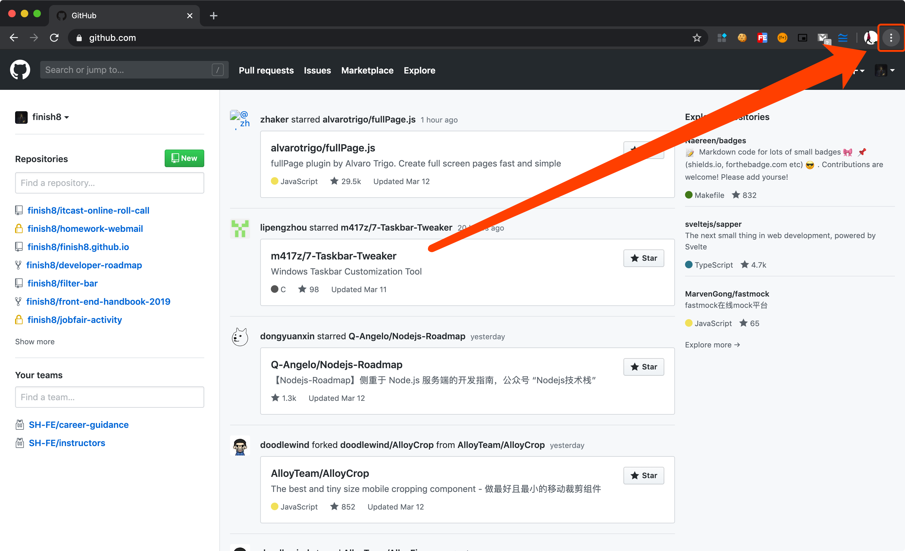
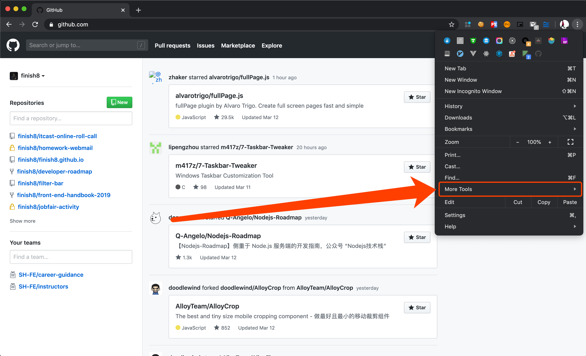
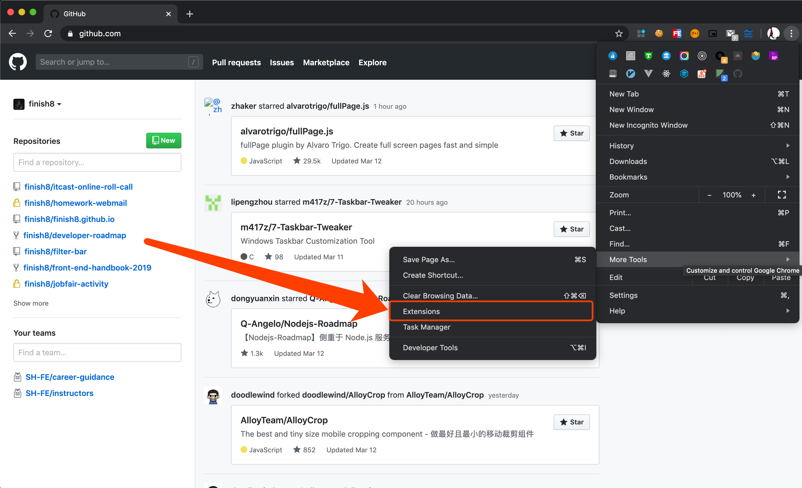
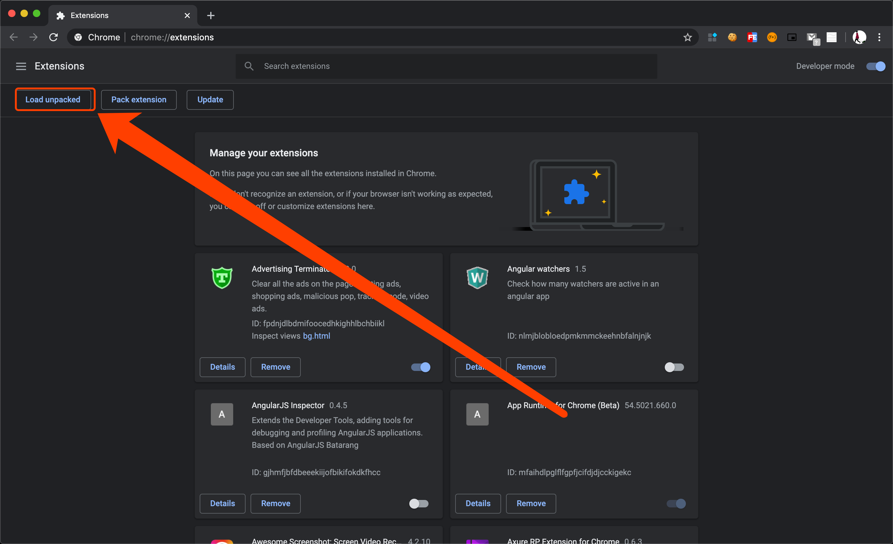

# 黑马直播间在线点名插件

## 描述

插件仅供黑马程序员内部使用，辅助班主任老师进行线上点名工作

## 下载

点击链接下载 

[https://github.com/finish8/itcast-online-roll-call/archive/v2.2.zip](https://github.com/finish8/itcast-online-roll-call/archive/v2.2.zip)

## 安装

插件未发布到谷歌商店，故需要开启浏览器开发人员模式，加载已解压的插件。

按照如下步骤进行操作即可：

## 使用

之前有给大家发过使用视频，这里就不再赘述了。

## 支持

* 如果你觉得这个插件还不错，可以通过右上角的 Star 来表示你的喜欢
* 企业微信中随时联系我解决bug

## 贡献

想贡献代码、解决 BUG 或者提高代码可读性？Welcome

## License

 @finish8
