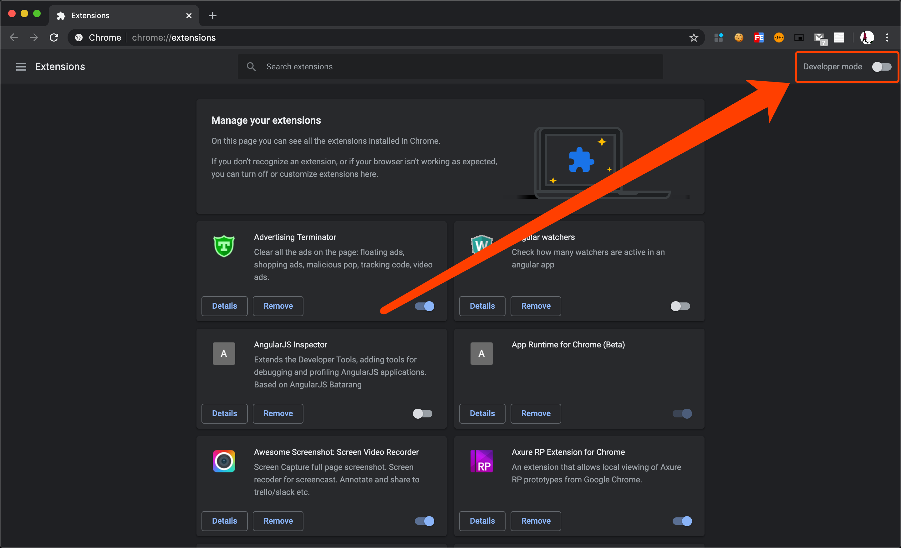
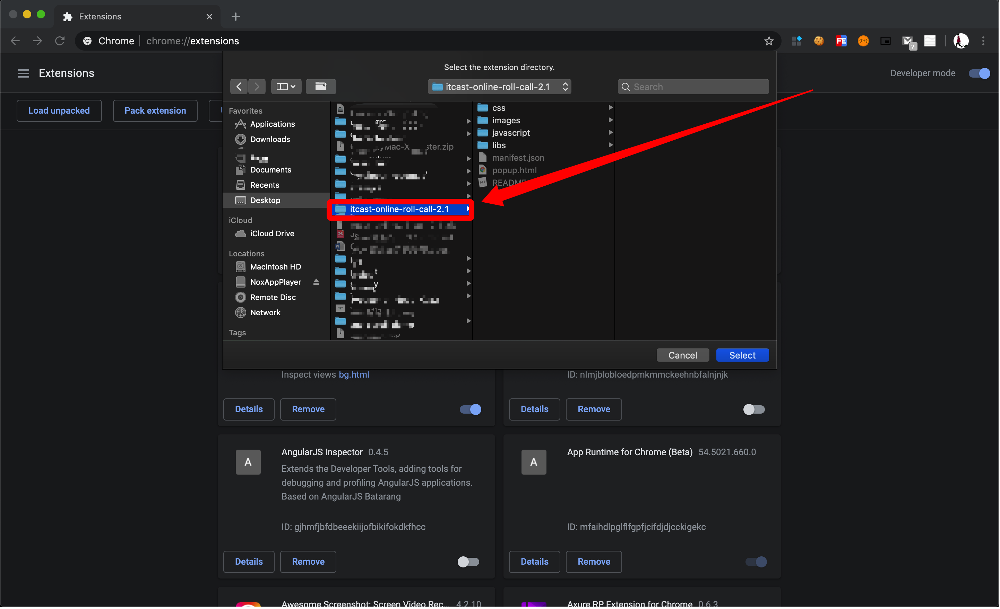

<h2 align="center">黑马直播间在线点名插件</h2>

插件仅供黑马程序员内部使用，辅助班主任老师进行线上点名工作

### 最新更新内容

* 全国班级合班需求
* 实现了以班级号作为学员名称前缀
* 保留之前按照校区划分的功能

### 下载

点击链接下载 

[https://github.com/A-GG/itcast-online-roll-call/releases/download/v2.3.1/v2.3.1.zip](https://github.com/A-GG/itcast-online-roll-call/releases/download/v2.3.2/v2.3.2.zip)

### 安装

插件未发布到谷歌商店，故需要开启浏览器开发人员模式，加载已解压的插件。

按照如下步骤进行操作即可：

### 使用

之前有给大家发过使用视频，这里就不再赘述了。

### 支持

* 如果你觉得这个插件还不错，可以通过右上角的 Star 来表示你的喜欢
* 企业微信中随时联系我解决bug

### 贡献

想贡献代码、解决 BUG 或者提高代码可读性？Welcome

### License

 @finish8
